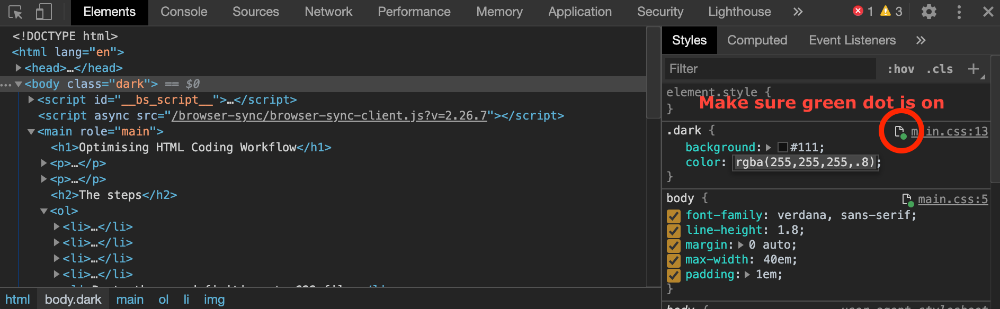

Here's how I write HTML/CSS. Read it with basic coding knowledge in mind.

## The steps

1. My editor is [Sublime Text 3](https://www.sublimetext.com/3). I love [Solarized colour scheme](https://packagecontrol.io/packages/Solarized%20Color%20Scheme).
2. Install following packages:
    - [eCSStractor](https://packagecontrol.io/packages/eCSStractor)
    - [Emmet](https://packagecontrol.io/packages/Emmet)
3. Start writing HTML using [Emmet](https://emmet.io/) syntax.
4. Select the HTML you wrote and call [eCSStractor](https://packagecontrol.io/packages/eCSStractor).
5. Paste the css definitions to CSS file.
6. Open HTML in Chrome.
7. Open Chrome Developer Tools and switch to Sources tab.
8. Choose Filesystem on sidebar and load the current working directory to make files editable on Chrome's inspector.
9. Move to Elements tab, choose the element where you want to edit the CSS for and edit it. It automatically saves the change to the file as long as you make sure the green indicator is on!

10. Install [PerfectPixel](https://chrome.google.com/webstore/detail/perfectpixel-by-welldonec/dkaagdgjmgdmbnecmcefdhjekcoceebi) Chrome extension.
11. Export your design data to an image file (PNG, JPG etc.)
12. Load the design image to PerfectPixel.
13. Compare with your HTML and fix to match the design. Keep using the inspector!

## Other useful Sublime Text packages I use

- [NeoVintageous](https://packagecontrol.io/packages/NeoVintageous) (I'm a former Vim user who cannot go back)
- [AdvancedNewFile](https://packagecontrol.io/packages/AdvancedNewFile)
- [AutoFileName](https://packagecontrol.io/packages/AutoFileName)
- [BetterFindBuffer](https://packagecontrol.io/packages/BetterFindBuffer)
- [eCSStractor](https://packagecontrol.io/packages/eCSStractor)
- [Emmet](https://packagecontrol.io/packages/Emmet)
- [DocBlockr](https://packagecontrol.io/packages/DocBlockr)
- [Git](https://packagecontrol.io/packages/Git) (though I use Git mainly on Terminal window)
- [GitGutter](https://packagecontrol.io/packages/GitGutter)
- [HTML Boilerplate](https://packagecontrol.io/packages/HTML%20Boilerplate)
- [HTML-CSS-JS Prettify](https://packagecontrol.io/packages/HTML-CSS-JS%20Prettify)
- [HTMLAttributes](https://packagecontrol.io/packages/HTMLAttributes)
- [MarkdownPreview](https://packagecontrol.io/packages/MarkdownPreview)
- [Minify](https://packagecontrol.io/packages/Minify)
- [Placeholders](https://packagecontrol.io/packages/Placeholders)
- [SublimeCodeIntel](https://packagecontrol.io/packages/SublimeCodeIntel)
- [Terminal](https://packagecontrol.io/packages/Terminal)
- [WordPress](https://packagecontrol.io/packages/WordPress)

Feel free to share tips to make it more efficient!
