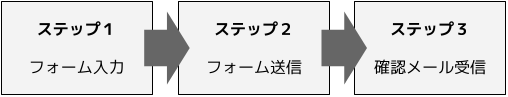

## 代替テキストの必要性

HTML では基本的に、すべての情報をテキストで表現する必要があります。画像を配置するときは、画像の内容を表現する代替テキストを用意します。そうすることで、

- エラーによって画像が表示されなかったとしても、情報を読み取ることができる
- アクセシビリティ対策として、読み上げソフトでも画像の内容を理解できるようにする
- SEO対策として、ボットにも理解できるようにする

などの利点があります。

## 画像に短い文字が入っている場合は、`alt` 属性

代替テキストの一番基本的な方法です。たとえばロゴなど、画像に文字そのものが入っていて読むことができるものは、それを `img` タグの `alt` 属性に入れます。

```html

```

画像に含まれる文字情報が比較的短いものは、これで十分です。

## 読み上げられる必要がないものは、空の `alt` 属性値

画像の `alt` 属性には必ず何か値を入れないといけないと思われがちですが、正しくは「空でもいいが、設定しなければいけない」です。

空の `alt=""` が設定された画像は、読み上げソフトに「読み上げの必要がない画像」として認識されます。文字などの情報を含んでいない、イメージ画像や装飾目的の画像には空の `alt` を設定します。 `alt` が設定されていない画像は、画像のファイル名が読み上げられてしまいます。

個人的には、プロフィールなどのコンテンツで顔写真がある場合など、氏名は隣接するテキストに書かれていることが多く、「顔写真」や「プロフィール画像」などの説明を入れてもあまり意味をなさない情報だと思うので、空に設定することが多いです。通販サイトでの商品画像なども同様に考えます。

## 長い文章やグラフなどには、 `visually-hidden` クラス

複雑な図などで文字情報が多く、 `alt` のみでは説明が難しい場合は、[読み上げソフトだけに認識される形で](https://www.a11yproject.com/posts/2013-01-11-how-to-hide-content/)別途コンテンツを用意し、必要に応じてリストやテーブルなども使うようにすることもできます。たとえば下記のような図は、順序付きリストで表現することができます。



```html

<ol class="visually-hidden">
  <li>
    ステップ１：<br>
    フォームに入力する
  </li>
  <li>
    ステップ２：<br>
    フォームを送信する
  </li>
  <li>
    ステップ３：<br>
    確認メールを受信する
  </li>
</ol>
```

ただし、この手の画像は前後の本文に同等の内容が含まれていて、分かりやすさを補完するために画像が用意されていることも多いので、その場合は隠れ要素は不要で `alt` 属性も空で問題ないと思います。

## `alt` 属性の設定漏れを防ぐために

いざコーディングが終わってみると、画像の `alt` 属性はブラウザで表示するだけでは見て取れないので、設定漏れがないかどうかをチェックするにはツールを使うと便利です。

### ブラウザの拡張機能

[WAVE](https://wave.webaim.org/extension/)という、アクセシビリティ機能をチェックするためのブラウザ拡張機能があります。Chrome と FireFox 用があり、 `alt` 属性の有無を含めた、アクセシビリティに関する様々なチェックができます。

コーディング作業中に、 `alt` 属性を設定したあとに画像が差し替えられて内容が食い違ってしまうようなミスも、このツールで `alt ` の内容を表示させることで気付くことができます。

### HTMLチェックツール

[W3CのHTMLチェッカー](https://validator.w3.org/)を使うと、 `alt` 属性の抜けた `img` タグがあればエラーとして指摘されます。こちらでは全ての `alt` 属性の内容をレビューすることはできませんが、そもそも設定し忘れているケースは拾うことができます。

## 参考リンク

- [WAVE Web Accessibility Evaluation Tool](https://wave.webaim.org/extension/)
- [W3C Markup Validation Service](https://validator.w3.org/#validate_by_input)
- [The A11Y Project: How to hide content](https://www.a11yproject.com/posts/2013-01-11-how-to-hide-content/)
