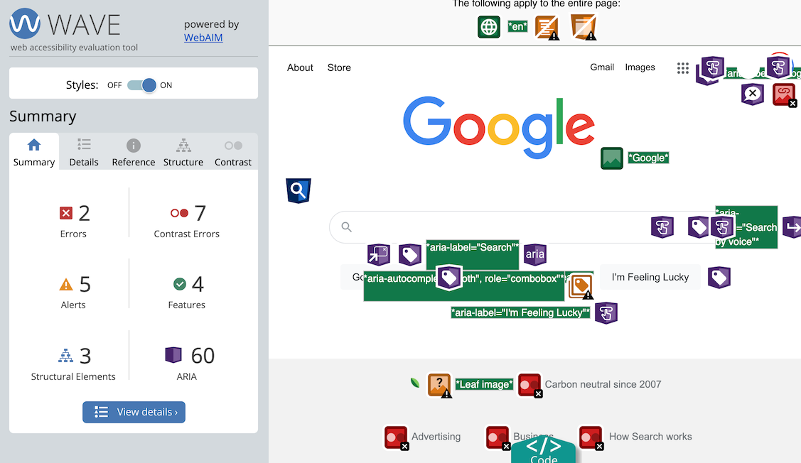
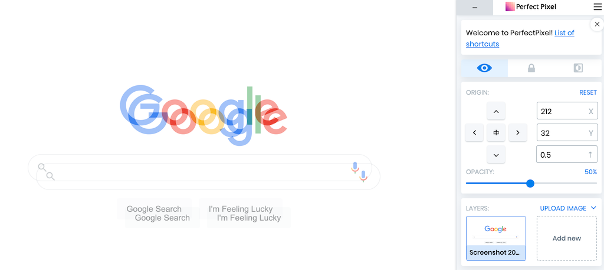

HTMLは作成後、ブラウザで確認したときにパッと見では問題なく表示できていても、記述ミスが隠れていることがあります。そういった見た目には分かりにくい不具合を検出するには、ツールが必要になります。

目に見えない部分にもこだわることで、SEOやアクセシビリティの対策にもつながります。

## W3Cチェッカー

- [HTML検証ツール](https://validator.w3.org/)
- [CSS検証ツール](https://jigsaw.w3.org/css-validator/)

W3Cが提供しているHTMLとCSSの文法チェッカーです。HTMLはタグの閉じ忘れ、不正な入れ子構造、属性の不足や重複を、CSSはスペルミスやカッコの閉じ忘れなど、基本的な記述ミスを検出してくれます。

公開済みのサイトであればURLを指定してチェックすることができます。公開前のサイトは、「Validate by File Upload」からHTMLファイルをアップロードするか、「Validate by direct input」タブにHTMLのソースコードをコピペして検証します。

この後に紹介する[Web Developerブラウザ拡張](#section3)を使うと、ツールを簡単に呼び出すことができるようになります。

## WAVE

- [Chrome用ブラウザ拡張](https://chrome.google.com/webstore/detail/wave-evaluation-tool/jbbplnpkjmmeebjpijfedlgcdilocofh)
- [FireFox用ブラウザ拡張](https://addons.mozilla.org/en-US/firefox/addon/wave-accessibility-tool/)
- [公式サイト](https://wave.webaim.org/)

アクセシビリティ対応が適切にできているかのチェックを行うブラウザ拡張機能です。

インストール後、ブラウザで対象のページを開いた状態でツールバーのアイコンをクリックすると、ページ構造や画像の `alt` 属性値などを見やすく表示してくれます。そのうえで、色のコントラストや画像の代替テキストなどに問題があれば、エラーや警告を表示します。

表示をもとに戻すには、アイコンをもう一度クリックするか、ページをロードし直します。

## Web Developer

- [Chrome用ブラウザ拡張](https://chrome.google.com/webstore/detail/web-developer/bfbameneiokkgbdmiekhjnmfkcnldhhm)
- [FireFox用ブラウザ拡張](https://addons.mozilla.org/en-GB/firefox/addon/web-developer/)
- [公式サイト](https://chrispederick.com/work/web-developer/)

ウェブ開発に欠かせない検証ツールを集めた、ブラウザ拡張機能です。

インストール後、ブラウザで対象のページを開いた状態でツールバーのアイコンから、多種多様な検証ツールを呼び出すことができます。CSS、JavaScript、Cookieの無効化、アンカーの表示、フォーム要素のチェックなど、本当にありとあらゆるツールが揃っています。

先に紹介した[W3Cのチェッカー](#section1)も、Toolsタブから簡単に利用できるようになっています。「Validate local HTML (CSS)」を使うと、表示中のページのソースコードを自動的にコピペして検証してくれるのでとても手軽です。

## PerfectPixel

- [Chrome用ブラウザ拡張](https://chrome.google.com/webstore/detail/perfectpixel-by-welldonec/dkaagdgjmgdmbnecmcefdhjekcoceebi)
- [公式サイト](https://www.welldonecode.com/perfectpixel/)

デザインにどれだけ忠実なコーディングができているかを確認するためのブラウザ拡張機能です。

コーディングの後、デザインデータとブラウザ画面を並べて見比べただけでは、細かいズレなどを見落としてしまいがちです。この拡張機能は、デザインの画像データを半透明の状態でブラウザに表示中のページに重ねて表示させ、デザインとコーディング成果物をトレースしてチェックすることができます。余白が違っていないか、文字サイズが合っているかなど、デザインとの差異が一目瞭然になります。

デザインは、PNGやJPEGなどの画像として用意します。ツールバーアイコンをクリックするとウィンドウが出るので、ドラッグアンドドロップでデザイン画像を追加します。複数画像を追加して切り替えることができ、追加済みの画像はドメインごとに記録されるので、次にページを開いたときも画像を追加し直す必要がありません。

## Tabキー

ツールではないのですが、作成したページをマウスやタッチパッドを使わず、キーボードだけで閲覧してみてください。リンクやボタンなどのクリックさせる要素はTabキーで移動することになりますが、問題なく操作できるでしょうか。

キーボードだけでサイトを利用できるようにすることはアクセシビリティ対策の1つです。実際にキーボードで操作してみると、クリックできるはずの要素を `div` タグで記述してしまったり、マウスオーバーにしか対応していないUIでは問題があることが分かると思います。

## Lighthouse

Chromeブラウザの開発者ツールに、「Lighthouse」というタブがあります。Googleの[PageSpeed Insights](https://developers.google.com/speed/pagespeed/insights/)と同等の測定を、開発中のサイトに対して行うことができます。

インストールされているブラウザの拡張機能が測定結果に影響しないように、シークレットモードで実施するほうが良いようです。

サイト公開後にPageSpeed対策をしようとすると難航しがちなので、開発中の段階でパフォーマンスの良いページを作るように意識するほうが得策だと思います。

## Web Disability Simulator

- [Chrome用ブラウザ拡張](https://chrome.google.com/webstore/detail/web-disability-simulator/olioanlbgbpmdlgjnnampnnlohigkjla/)
- [公式サイト（GitHub）](https://github.com/Metamatrix/Web-Disability-Simulator)

様々な特性を持つユーザーからサイトがどのように見えるかをシミュレーションするための、Chrome拡張機能です。アクセシビリティのチェックに使用します。

インストールし、ツールバーのアイコンをクリックするとメニューが表示されます。

4つのドロップダウンからシミュレーション対象を選ぶのですが、よく使うのは「Sight」リストでしょうか。リスト中の「～color blindness」がつくものは、タイプ別の色覚特性をシミュレーションするもので、中でも「Red-Green」、赤と緑が見えにくいタイプの色覚特性は男性の20人に1人が持つと言われているので、サイト訪問者の中にもそれなりの数が該当すると考えられます。シミュレーションしてみると、背景色と文字色の組み合わせによっては文字が見えにくかったり、情報の区別を色の違いのみに頼ったデザインにしていると区別が効かなくなる、などの不便に気が付きます。

「Mobility」メニューから、ポインタを自在に動かせないケースのシミュレーションができますが、こちらも使ってみると先に述べた[キーボード操作の重要性](#section5)が分かると思います。

見え方や操作性のアクセシビリティを改善することは、ユーザー全般にとって見やすい・使いやすいサイトづくりにつながるので、結果的にユーザビリティやUXが向上することになります。
