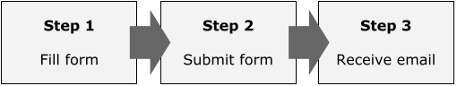

## Why it's important

In an HTML document, all information should be provided by some text. When placing an image, by adding an alternative text you can:

- Make sure to deliver the same information even if an error occurred during image load
- Improve accessibility by enabling screen readers to read the image
- Improve SEO by enabling search engine bots to understand the image


## If the text contained in image is short, use `alt` attribute

The most common method of providing alternative text is to use `alt` attribute on the `img` tag. If the image contains actual text and if it's short, this is an appropriate choice.

```html

```

## If the image is not to be read, add empty `alt`

Though the `alt` attribute is often thought as it needs to be filled, the correct rule is "the attribute must be set, but it can be empty".

If the image has an empty `alt`, screen readers skip reading it. Decorative images should have empty `alt`, because if you omit the attribute itself, screen readers may read its file path. Imagine how awful it could be!

For instance, I personally use empty `alt` for a person's profile picture as it often has the person's name near the image, and it seems meaningless to set "Profile picture" as the value. The same applies to the product pictures on e-commerces, unless it provides additional and unique information.

## For long sentence and charts, use `visually-hidden` CSS class

If the image contains complicated information like charts and a flat text within `alt` attribute isn't enough to explain it, you can provide an alternative HTML element with [`visually-hidden`](https://www.a11yproject.com/posts/2013-01-11-how-to-hide-content/) CSS class added to it so that the element is only available to screen readers while being hidden from the view. For example, the picture below can be presented by an ordered list alternatively.



```html

<ol class="visually-hidden">
  <li>
    Step 1:<br>
    Fill form
  </li>
  <li>
    Step 2:<br>
    Submit form
  </li>
  <li>
    Step 3:<br>
    Receive email
  </li>
</ol>
```

If a paragraph close to the image have the equal or similar information to the image content, then I don't think this method is necessary. Decide the most appropriate method considering the whole page structure.

## Preventing missing `alt`

When the page is all marked up, you can't spot missing `alt` attributes in the browser view. There are useful tools for the purpose.

### Browser extension

[WAVE](https://wave.webaim.org/extension/) is a browser extension offered for both Chrome and FireFox. It can validate various accessibility features as well as detecting missing `alt` attributes.

This tool displays all `alt` values set for images for you to see if the text matches the image content.

### HTML validation tool

[W3C's HTML validator](https://validator.w3.org/) warns you if an `img` tag misses `alt` attribute. It doesn't display `alt` values like WAVE does though, you can still detect cases where you forgot to set the attribute itself.

## References

- [WAVE Web Accessibility Evaluation Tool](https://wave.webaim.org/extension/)
- [W3C Markup Validation Service](https://validator.w3.org/#validate_by_input)
- [The A11Y Project: How to hide content](https://www.a11yproject.com/posts/2013-01-11-how-to-hide-content/)
