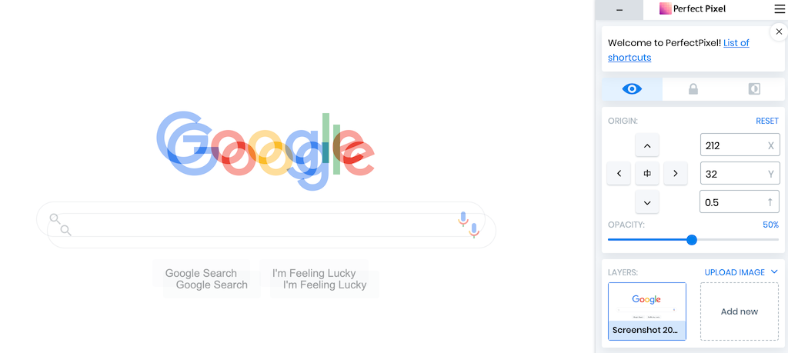

HTML errors are hard to detect by looking at browser window. For such cases, there are useful validation tools.

Paying attention to the invisible factors helps improve SEO and accessibility.

## The W3C validator

- [HTML validator](https://validator.w3.org/)
- [CSS validator](https://jigsaw.w3.org/css-validator/)

W3C provides HTML and CSS validators. HTML validator helps you find unclosed tags, invalid nesting and missing or duplicate attributes, and CSS validator detects basic mistakes such as misspelling and unclosed parentheses or braces.

If the site is already live, you can input its URL to validate. If not, you can either upload the HTML file from "Validate by File Upload" tab or copy and paste your code to "Validate by direct input" tab.

[Web Developer](#section3) browser extension comes in handy to use these validators.

## WAVE

- [Chrome browser extension](https://chrome.google.com/webstore/detail/wave-evaluation-tool/jbbplnpkjmmeebjpijfedlgcdilocofh)
- [FireFox browser extension](https://addons.mozilla.org/en-US/firefox/addon/wave-accessibility-tool/)
- [Official website](https://wave.webaim.org/)

WAVE is a browser extension that validates if the accessibility features are properly implemented.

Once installed, it displays information including page structure and `alt` attribute of images by clicking the icon on the browser toolbar. And it warns you about issues like colour contrast and inappropriate alternative texts for images.

To hide the results, click the icon again or reload the page.

## Web Developer

- [Chrome browser extension](https://chrome.google.com/webstore/detail/web-developer/bfbameneiokkgbdmiekhjnmfkcnldhhm)
- [FireFox browser extension](https://addons.mozilla.org/en-GB/firefox/addon/web-developer/)
- [Official website](https://chrispederick.com/work/web-developer/)

This extension collects various web validation tools in one place.

Once installed, you can call all kinds of validation tools from the toolbar icon. The list includes disabling CSS, JavaScript or Cookie, displaying anchors, form elements validation and many more.

[W3C validators](#section1), which was introduced earlier, is also included in this extension's palette. It can even copy and paste the local source code to the validator automatically.

## PerfectPixel

- [Chrome browser extension](https://chrome.google.com/webstore/detail/perfectpixel-by-welldonec/dkaagdgjmgdmbnecmcefdhjekcoceebi)
- [Official website](https://www.welldonecode.com/perfectpixel/)

PerfectPixel is a tool to check if the coded page aligns well with its design comp.

After coding the page, you could miss small differences if you only compared the visual with the design side by side. This extension displays the opaque image over the browser window so that you can trace them to find issues. You can see the problems with margins or font sizes clearly.

You need to export the design data as an image file like PNG or JPEG first. Click the toolbar icon to add the image. You can add multiple images, and it remembers the added images for each domains.

## Tab key

This is not a tool, but a way to check an important accessibility feature: the keyboard compatibility. Browse the page you coded without pointing devices and only with keyboard. Can you navigate through links and buttons with tab key without issues?

This is an easy way to detect if you have coded clickable elements with `div` tag or hoverable elements without click event.

## Lighthouse

Chrome DevTools has a tab named Lighthouse. It runs the same analysis as [PageSpeed Insights](https://developers.google.com/speed/pagespeed/insights/), even on a page in development.

It's better to run it in private mode so that other extensions don't affect the result.

Improving PageSpeed result after the site went live can be a nightmare. I think it's best if developers cared about it during the development.

## Web Disability Simulator

- [Chrome browser extension](https://chrome.google.com/webstore/detail/web-disability-simulator/olioanlbgbpmdlgjnnampnnlohigkjla/)
- [Official website (GitHub)](https://github.com/Metamatrix/Web-Disability-Simulator)

This extension lets you simulate how the page looks like to users with disabilities and improve its accessibility.

After installation, open the menu from toolbar icon.

The feature I find most useful is "Sight". It's said that 1 in 20 men has red-green colour blindness, so you can assume a considerable number of users could be affected if there was an issue. The simulator makes you realise if the text colour fades in the background, or you can't distinguish between multiple information if their classification relied on only colours.

"Mobility" option proves the importance of [keyboard compatibility](#section5).

Removing visual barriers and ensuring usability benefit not only people with disabilities but all users, because it improves general user experiences.
